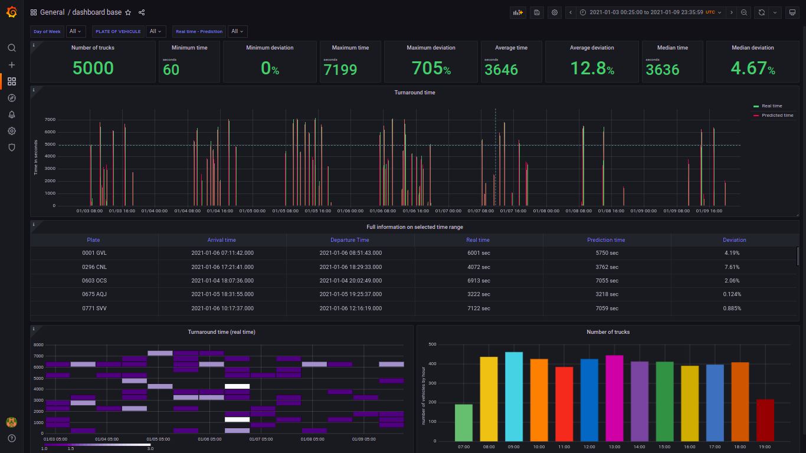
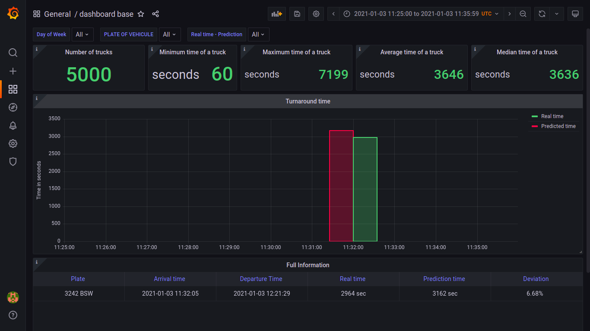

# Dashboards

<!-- TOC depthfrom:2 -->

- [Usage](#usage)
- [Escenario base](#escenario-base)
- [Escenario base con zoom](#escenario-base-con-zoom)

<!-- /TOC -->

## Usage

1. To load any dashboard in grafana, you must enter the following link, if the session is closed, it will ask you to enter your credentials first.

```
http://localhost:3000/dashboard/import
```

2. Then the `Upload JSON file` option is clicked and a window is displayed to upload the `.JSON` file, which is located in the `dashboard` folder, we select the file and press Enter.

3. Once the dashboard is loaded, the name, the folder, and its unique identifier appear, which are preconfigured in the Json file, these fields can be edited if desired.

4. After this we click on the `Import` option and a window is displayed with the control panels and the dashboard correctly loaded.

   - Note: If you want to load a dashboard that already exists, you must repeat steps 1-3, and in step 4 the `Import (Overwrite)` option will appear.

5. The dashboards that we load will appear in the menu on the left, in the `Dashboards` option, and in the `Manage` option.

## Escenario base



## Escenario base con zoom


