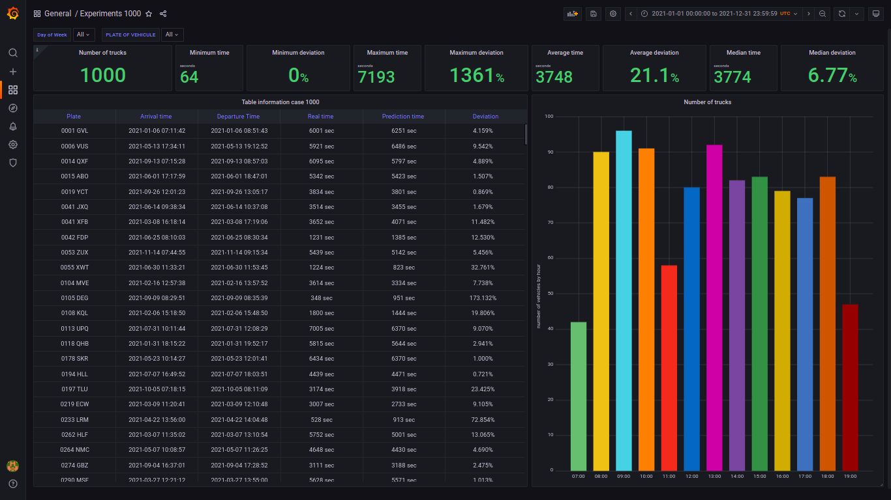
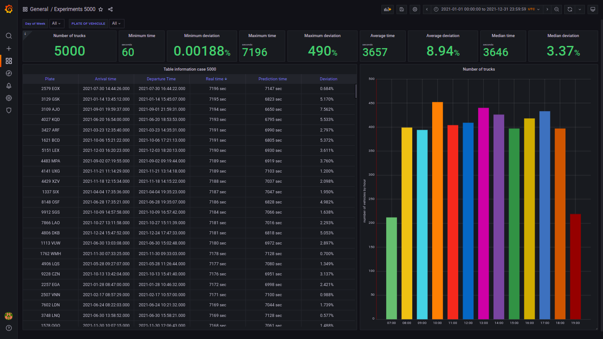
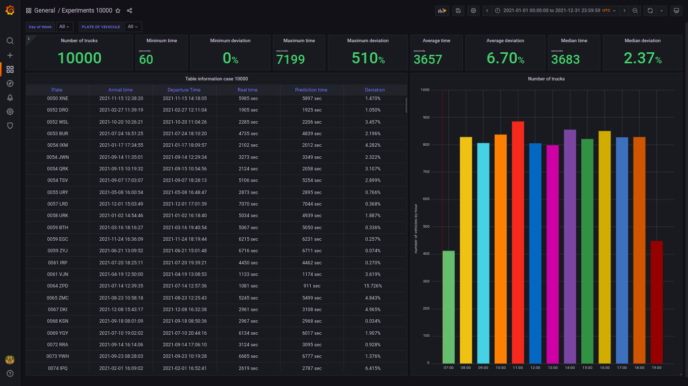

# Dashboards

<!-- TOC depthfrom:2 -->

- [Description](#description)
- [Escenario 1000](#escenario-case-1000)
- [Escenario 2500](#escenario-case-2500)
- [Escenario 5000](#escenario-case-5000)
- [Escenario 10000](#escenario-case-10000)

<!-- /TOC -->

## Description

This folder contains the JSON files with the data to train the C4.5 algorithm, the JSON file with the algorithm output, in that same step the prediction is stored in the database and the JSON file with the dashboard configuration for each experiment.

## Escenario case 1000

## Escenario case 2500

## Escenario case 5000

## Escenario case 10000

